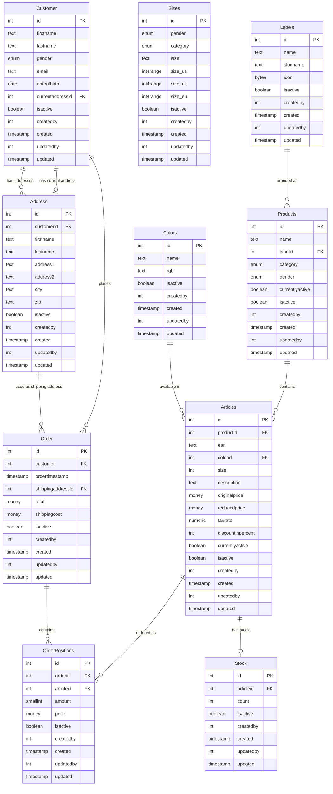

# Database Schema Diagram

This document contains a Mermaid Entity Relationship Diagram (ERD) for the WebShop database schema.

## Entity Relationship Diagram

## Table Descriptions

### Lookup Tables

- **Labels**: Brand/label information for products
- **Colors**: Color definitions with RGB values
- **Sizes**: Size definitions with US, UK, and EU conversions

### Core Tables

- **Customer**: Customer information with current address reference
- **Address**: Customer addresses (can have multiple per customer)
- **Products**: Product groups that contain multiple articles
- **Articles**: Specific product instances with size, color, and pricing
- **Order**: Order header with customer and shipping information
- **OrderPositions**: Order line items linking orders to articles
- **Stock**: Inventory count for each article

## Key Relationships

1. **Customer → Address**: One-to-many (customer can have multiple addresses)
2. **Customer → Address**: One-to-one (current address reference)
3. **Customer → Order**: One-to-many (customer can place multiple orders)
4. **Address → Order**: One-to-many (address can be used in multiple orders)
5. **Labels → Products**: One-to-many (label can have multiple products)
6. **Products → Articles**: One-to-many (product can have multiple articles)
7. **Colors → Articles**: One-to-many (color can be used in multiple articles)
8. **Articles → OrderPositions**: One-to-many (article can be in multiple orders)
9. **Articles → Stock**: One-to-one (each article has one stock entry)
10. **Order → OrderPositions**: One-to-many (order contains multiple positions)

## Audit Fields

All tables include standard audit fields:
- `isactive`: Soft delete flag (default: true)
- `createdby`: User ID who created the record
- `created`: Timestamp when record was created
- `updatedby`: User ID who last updated the record
- `updated`: Timestamp when record was last updated

## Indexes

The schema includes optimized indexes for:
- Email lookups (Customer)
- Foreign key relationships
- Active record filtering (partial indexes)
- Category and label filtering (Products)
- EAN lookups (Articles)
- Order timestamp queries
- Stock queries by article
