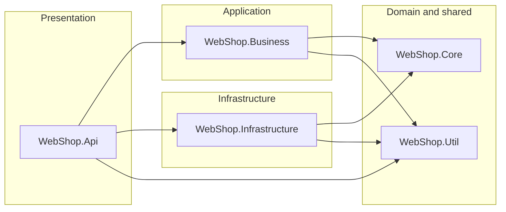

# Architecture Testing Guide

[← Back to Testing Guide](testing-comprehensive-guide.md) | [← Back to README](../README.md)

---

## Table of Contents

- [Overview](#overview)
- [Why Architecture Tests?](#why-architecture-tests)
- [Project Setup](#project-setup)
- [Test Categories](#test-categories)
  - [Dependency Tests](#dependency-tests)
  - [Dependency Guard Tests](#dependency-guard-tests)
  - [Naming Convention Tests](#naming-convention-tests)
  - [Structure Tests](#structure-tests)
- [Allowed Dependency Direction](#allowed-dependency-direction)
- [How to Run](#how-to-run)
- [Adding New Rules](#adding-new-rules)
- [Reference](#reference)

---

## Overview

Architecture tests are automated tests that validate the structural integrity of the codebase. They enforce Clean Architecture dependency direction, naming conventions, and design rules so violations are caught during development and CI rather than manual code review.

The project uses **[NetArchTest.Rules](https://www.nuget.org/packages/NetArchTest.Rules)** to scan assemblies at test time and assert architectural constraints. Tests are standard xUnit facts that run alongside unit tests.

## Why Architecture Tests?

> "Even the most well-planned software projects decay because of technical debt." — Milan Jovanovic

Without automated enforcement, architectural boundaries erode gradually:

- A developer adds a direct Dapper call in a Business service "just this once"
- A controller bypasses the service layer and calls a repository directly
- An entity class picks up an infrastructure dependency through a helper

Each violation is small on its own, but they compound into tightly coupled, hard-to-test code. Architecture tests **shift left** by catching these violations the moment they are introduced.

## Project Setup

Architecture tests live in a dedicated project:

```
tests/
├── WebShop.ArchitectureTests/       ← Architecture constraint tests
│   ├── DependencyTests.cs           ← Layer dependency rules
│   ├── DependencyGuardTests.cs      ← Infrastructure library guards
│   ├── NamingConventionTests.cs     ← Naming conventions
│   └── StructureTests.cs            ← Structural rules
├── WebShop.UnitTests/               ← Unit tests
└── WebShop.IntegrationTests/        ← Integration tests
```

The project references all source projects to access their assemblies:

```xml
<ProjectReference Include="..\..\src\WebShop.Api\WebShop.Api.csproj" />
<ProjectReference Include="..\..\src\WebShop.Business\WebShop.Business.csproj" />
<ProjectReference Include="..\..\src\WebShop.Infrastructure\WebShop.Infrastructure.csproj" />
<ProjectReference Include="..\..\src\WebShop.Core\WebShop.Core.csproj" />
```

Each test class obtains assembly references through well-known marker types:

```csharp
private static readonly Assembly CoreAssembly = typeof(BaseEntity).Assembly;
private static readonly Assembly BusinessAssembly = typeof(DependencyInjection).Assembly;
private static readonly Assembly InfrastructureAssembly = typeof(DataAccessExtensions).Assembly;
private static readonly Assembly ApiAssembly = typeof(BaseApiController).Assembly;
```

## Test Categories

### Dependency Tests

**File:** `DependencyTests.cs` (9 tests)

Enforces the Clean Architecture dependency rule: dependencies only point inward.

| Rule | What it prevents |
|------|-----------------|
| Core → no Business | Domain acquiring service-layer logic |
| Core → no Infrastructure | Domain acquiring persistence dependencies |
| Core → no Api | Domain acquiring presentation concerns |
| Business → no Infrastructure | Business layer coupling to data access implementation |
| Business → no Api | Business layer coupling to presentation |
| Infrastructure → no Api | Infrastructure coupling to presentation |
| Business → Core (positive) | Verifies Business actually uses Core types |
| Infrastructure → Core (positive) | Verifies Infrastructure implements Core contracts |
| Api → Business (positive) | Verifies Api orchestrates through services |

### Dependency Guard Tests

**File:** `DependencyGuardTests.cs` (8 tests)

Guards inner layers from leaking infrastructure-specific libraries. These tests prevent the Core and Business layers from taking direct dependencies on technology choices that belong in outer layers.

| Guarded Library | Belongs In | Why |
|----------------|-----------|-----|
| **Dapper** | Infrastructure | ORM is a persistence concern |
| **Npgsql** | Infrastructure | PostgreSQL driver is a database-specific concern |
| **DbUp** | Api (startup) | Migration tooling is a deployment concern |
| **StackExchange.Redis** | Infrastructure | Cache provider is an infrastructure concern |

### Naming Convention Tests

**File:** `NamingConventionTests.cs` (10 tests)

Enforces consistent naming across all layers for discoverability and self-documenting code.

| Convention | Scope | Example |
|-----------|-------|---------|
| Interfaces start with `I` | Core, Business, Infrastructure | `ICustomerRepository`, `IOrderService` |
| Services end with `Service` | Business.Services | `CustomerService`, `OrderService` |
| Service interfaces in `Services.Interfaces` | Business | `WebShop.Business.Services.Interfaces.ICustomerService` |
| Repositories end with `Repository` | Infrastructure.Repositories | `CustomerRepository` |
| Validators end with `Validator` | Business.Validators | `CreateCustomerDtoValidator` |
| Controllers end with `Controller` | Api.Controllers | `CustomerController` |
| External services end with `Service` | Infrastructure.Services.External | `AsmService`, `SsoService` |
| DTOs reside in `DTOs` namespace | Business.DTOs | `WebShop.Business.DTOs.CustomerDto` |

### Structure Tests

**File:** `StructureTests.cs` (10 tests)

Enforces structural rules: correct inheritance, interface visibility, and encapsulation.

| Rule | Why |
|------|-----|
| Core interfaces are public | Consumed by other layers as contracts |
| Business interfaces are public | Injected by the API layer |
| Repositories depend on Core | Must implement Core-defined interfaces |
| Repositories are sealed | Concrete leaf classes; prevents accidental inheritance |
| Core entities inherit from `BaseEntity` | Consistent identity and auditing |
| Validators inherit from `AbstractValidator<T>` | FluentValidation pattern |
| Controllers inherit from `ControllerBase` | ASP.NET MVC pattern (via `BaseApiController`) |
| External services depend on Core | Implement Core-defined service interfaces |
| Controllers don't access repositories | Must go through Business layer |
| Core concrete types in Core namespace | Domain purity |

## Allowed Dependency Direction



**Pragmatic exception:** Api references Infrastructure for the composition root (DI registration in `Program.cs`). No application logic in Api should depend on Infrastructure types directly — architecture tests enforce that controllers cannot access `WebShop.Infrastructure.Repositories`.

## How to Run

```bash
# Run all architecture tests
dotnet test tests/WebShop.ArchitectureTests

# Run a specific test category
dotnet test tests/WebShop.ArchitectureTests --filter "FullyQualifiedName~DependencyTests"
dotnet test tests/WebShop.ArchitectureTests --filter "FullyQualifiedName~DependencyGuardTests"
dotnet test tests/WebShop.ArchitectureTests --filter "FullyQualifiedName~NamingConventionTests"
dotnet test tests/WebShop.ArchitectureTests --filter "FullyQualifiedName~StructureTests"
```

Architecture tests execute in ~150ms and require no external dependencies (no database, no network).

## Adding New Rules

To add a new architectural constraint:

1. Identify which test file the rule belongs in (dependency, guard, naming, or structure)
2. Add a new `[Fact]` method following the existing pattern
3. Use the NetArchTest fluent API:

```csharp
// Negative rule (must NOT have dependency)
var result = Types.InAssembly(TargetAssembly)
    .That().ResideInNamespace("WebShop.Layer.Namespace")
    .And().AreClasses()
    .ShouldNot().HaveDependencyOn("Forbidden.Namespace")
    .GetResult();

result.IsSuccessful.Should().BeTrue(
    because: "clear explanation of why this rule exists");

// Positive rule (MUST have dependency)
var types = Types.InAssembly(TargetAssembly)
    .That().HaveDependencyOn("Required.Namespace")
    .GetTypes();

types.Should().NotBeEmpty(
    because: "clear explanation of why this dependency is expected");
```

**Key NetArchTest APIs:**
- `Types.InAssembly()` — scope to an assembly
- `.That()` — filter types
- `.Should()` / `.ShouldNot()` — assertion direction
- `.HaveDependencyOn()` / `.HaveDependencyOnAny()` — dependency checks
- `.BeSealed()`, `.BePublic()` — modifier checks
- `.HaveNameStartingWith()`, `.HaveNameEndingWith()` — naming checks
- `.ResideInNamespace()` — namespace checks
- `.Inherit()`, `.ImplementInterface()` — type hierarchy checks

## Reference

- [Shift Left with Architecture Testing in .NET](https://www.milanjovanovic.tech/blog/shift-left-with-architecture-testing-in-dotnet) (Milan Jovanovic)
- [Enforcing Software Architecture with Architecture Tests](https://www.milanjovanovic.tech/blog/enforcing-software-architecture-with-architecture-tests) (Milan Jovanovic)
- [NetArchTest on GitHub](https://github.com/BenMorris/NetArchTest)
- [NetArchTest on NuGet](https://www.nuget.org/packages/NetArchTest.Rules)
