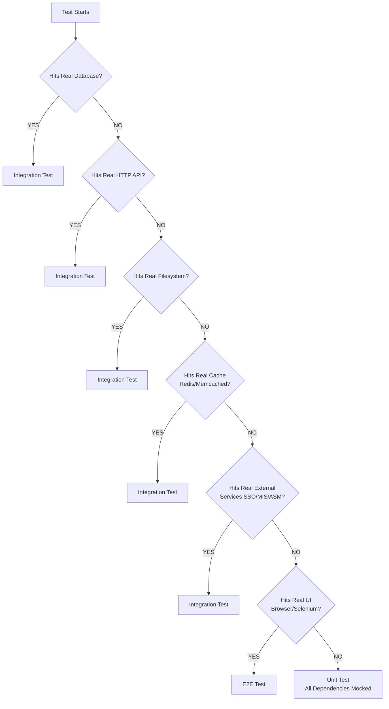

# Testing Comprehensive Guide

[← Back to README](../README.md)

---

## Table of Contents

- [Executive Summary](#executive-summary)
- [Testing Standards & Guidelines](#testing-standards--guidelines)
- [Test Categorization Decision Tree](#test-categorization-decision-tree)
- [Common Anti-Patterns (Test Smells)](#common-anti-patterns-test-smells)
- [When Each Test Catches Bugs](#when-each-test-catches-bugs)
- [Code Coverage Requirements](#code-coverage-requirements)
- [Coverage Configuration & Exclusions](#coverage-configuration--exclusions)
- [Coverage Status & Analysis](#coverage-status--analysis)
- [Compliance Assessment](#compliance-assessment)
- [Architecture Tests](#architecture-tests)
- [Quick Reference](#quick-reference)
- [Implementation Patterns](#implementation-patterns)
- [Dapper Repository Testing](#dapper-repository-testing)
- [CI/CD Integration](#cicd-integration)
- [Implementation Details](#implementation-details)
- [Troubleshooting](#troubleshooting)
- [Recommended .NET Test Stack](#recommended-net-test-stack-industry)
- [Resources](#resources)

---

## Executive Summary

This comprehensive guide consolidates all testing standards, strategies, and coverage requirements. It establishes a standardized Testing Pyramid approach, shifting defect detection from release to development phase.

### Key Achievements

- ✅ **891+ Unit Tests** implemented across all layers (Api, Business, Infrastructure)
- ✅ **200 Integration Tests** (API + repository) with real PostgreSQL
- ✅ **Business Services Coverage** (100% line and branch for included code; exceeds 85% target)
- ✅ **Comprehensive Test Suite** covering critical paths, edge cases, and error scenarios
- ✅ **CI/CD Integration** with coverage gates and test categorization
- ✅ **Architecture tests** enforce Clean Architecture dependency rules and controller/repository boundaries

### Current Status

| Layer (included code only) | Line | Branch | Status |
|----------------------------|------|--------|--------|
| **WebShop.Business**       | 100% | 100%   | ✅ **EXCEEDS TARGET** |
| **Overall (included)**     | ~98.5% | ~90% | ✅ **EXCEEDS TARGET** |

**Note**: With `tests/CodeCoverage.runsettings`, only a subset of `src` is included (e.g. Business Services/Validators/Helpers/Models; some Api/Infrastructure). Excluded: DTOs, Repositories, Program/DI, auth controllers. Re-verify with: `dotnet test tests/WebShop.UnitTests --settings tests/CodeCoverage.runsettings --collect:"XPlat Code Coverage"` then inspect the generated `coverage.cobertura.xml` (package `WebShop.Business` and root `line-rate`).

---

## Testing Standards & Guidelines

### Testing Layers Summary (Quick Reference)

| Test Type       | Scope               | Speed      | Isolation | Confidence          | Cost   |
| --------------- | ------------------- | ---------- | --------- | ------------------- | ------ |
| **Unit**        | Single class/method | ⚡ Fastest  | High      | Low–Medium          | 💲 Low |
| **Integration** | Multiple components | 🚀 Medium  | Partial   | Medium–High         | 💲💲   |
| **E2E**         | Full system         | 🐢 Slowest | None      | Highest (realistic) | 💲💲💲 |

### The Testing Pyramid

We follow the industry-standard Testing Pyramid (Martin Fowler, Microsoft):

- **70% + Unit Tests**: Fast, isolated tests; no external dependencies; run on every commit
- **20% + Integration Tests**: API and database contract verification; real dependencies
- **10% + E2E Tests**: Critical user journeys; full stack validation

*Source: [Martin Fowler - Practical Test Pyramid](https://martinfowler.com/articles/practical-test-pyramid.html)*

### Industry Coverage Targets by Test Type

| Test Type | Typical Industry Target | Purpose |
|-----------|--------------------------|---------|
| **Unit Tests** | 70–90%+ | Fast logic validation |
| **Integration Tests** | 20–40% of critical paths | Contract & wiring validation |
| **E2E Tests** | 5–15% of flows | User journey confidence |

### Core Principles (FIRST)

1. **Fast**: Execute in milliseconds; entire unit suite in seconds
2. **Isolated**: No external dependencies (DB, network, filesystem)
3. **Repeatable**: Same input → same output every run
4. **Self-validating**: Pass/fail is unambiguous; no manual inspection
5. **Timely**: Written close to the code they test

### Unit Testing Standards

#### Definition

Testing individual components in isolation from external dependencies.

#### Guidelines

- **Scope**: Logic, algorithms, data transformation
- **Dependencies**: All external dependencies must be mocked/stubbed
- **Speed**: Entire suite runs in seconds

#### When to Write

- **Mandatory**: Every new feature or bug fix
- **TDD**: Preferably before implementation

#### When to Avoid (Use Integration/E2E Instead)

- Database calls
- HTTP calls
- File system access
- Message brokers
- Complex framework wiring

#### Importance (Benefits & Limitations)

**Benefits**: Fast feedback loop; pinpoints failures precisely; cheap to maintain; encourages good design (SOLID).

**Limitations**: Cannot detect wiring/config issues; cannot catch integration failures; may give false confidence alone.

#### Checklist

##### Preparation & Naming

- [ ] **Naming**: `MethodName_Condition_ExpectedResult`
- [ ] **AAA Pattern**: Arrange-Act-Assert structure
- [ ] **Trait Attributes**: `[Trait("Category", "Unit")]`

##### Isolation & Mocks

- [ ] **No External Calls**: All DB, HTTP, file system calls mocked
- [ ] **No System Dependencies**: No reliance on clocks or random generators
- [ ] **Configuration**: Environment variables injected explicitly

##### Assertion & Logic

- [ ] **One Logical Concept**: One behavior per test; multiple assertions OK when testing same outcome (Microsoft best practice)
- [ ] **Meaningful Assertions**: Clear failure messages; use FluentAssertions for readability
- [ ] **Boundary Testing**: Null, empty, negative, max limits

##### What to Test / What NOT to Test

| Layer | Test | Skip |
|-------|------|------|
| **Controllers** | HTTP status codes, mapping, error handling | Framework code |
| **Services** | Business logic, validation, DTO mapping, edge cases | Third-party libs |
| **Repositories** | CRUD, soft delete, query filters, batch lookups | Simple getters/setters |
| **All** | Public API behavior | Private methods |

### Integration Testing Standards

#### Definition

Testing how different modules interact with real dependencies.

#### Guidelines

- **Scope**: API endpoints, database queries, service-to-service communication
- **Dependencies**: Real PostgreSQL (`webshop_test`), actual HTTP calls via `WebApplicationFactory`
- **State**: Database reset (`TRUNCATE`) at start of each test for isolation
- **Avoid**: In-memory DB (e.g. EF InMemory) for integration—use real DB or Testcontainers to catch schema/query issues
- **Execution**: **Must run sequentially**—Infrastructure and API integration tests share the same database

#### When to Write

- New API endpoints
- Database schema changes
- Third-party SDK integration

#### When to Avoid (Use Unit/E2E Instead)

- Pure business logic (unit instead)
- Full UI workflows (E2E instead)

#### Importance (Benefits & Limitations)

**Benefits**: Catches real-world failures; validates configuration; detects schema mismatches; higher confidence than unit tests.

**Limitations**: Slower than unit tests; more brittle; requires test infrastructure.

#### Running Integration Tests

Run **sequentially** via `pwsh scripts/run-tests.ps1 -TestType Integration`. Do not run `dotnet test --filter "Category=Integration"` across the solution—API and repository tests share `webshop_test`; parallel runs cause deadlocks and FK violations. See [Quick Reference](#quick-reference) and [Integration Test Failures](#integration-test-failures-deadlocks-fk-violations-404s).

### E2E Testing Standards

#### Definition

Testing complete application from user perspective.

#### Guidelines

- **Scope**: Critical User Journeys only (Login, Checkout, Sign-up)
- **Data**: Seeded test data, no production data reliance
- **Resiliency**: Automatic waits, no hard-coded sleeps
- **Selectors**: Prefer `data-testid` over brittle CSS/XPath

#### When to Write

- Stable features only
- Critical user journeys

#### When to Avoid (Use Unit/Integration Instead)

- Edge-case logic validation
- Large combinational testing
- Fast feedback loops

#### Importance (Benefits & Limitations)

**Benefits**: Highest confidence; tests real behavior; finds environment issues; validates deployments.

**Limitations**: Slow; flaky if poorly designed; expensive to maintain; hard to debug.

---

## Test Categorization Decision Tree

### The Golden Rule

**Does the test use ANY real external dependencies?**

- ❌ **NO (all mocked/stubbed)** → Unit Test
- ✅ **YES (real database/API/filesystem)** → Integration Test
- ✅ **YES (real UI + deployed app)** → E2E Test

### Key Insight

The determining factor is **mock vs real dependencies**, not conceptual integration points.

### Decision Tree Flowchart


```mermaid
flowchart TD
    A[Test Starts] --> B{Hits Real Database?}
    B -->|YES| C[Integration Test]
    B -->|NO| D{Hits Real HTTP API?}
    D -->|YES| E[Integration Test]
    D -->|NO| F{Hits Real Filesystem?}
    F -->|YES| G[Integration Test]
    F -->|NO| H{Hits Real Cache<br/>Redis/Memcached?}
    H -->|YES| I[Integration Test]
    H -->|NO| J{Hits Real External<br/>Services SSO/MIS/ASM?}
    J -->|YES| K[Integration Test]
    J -->|NO| L{Hits Real UI<br/>Browser/Selenium?}
    L -->|YES| M[E2E Test]
    L -->|NO| N[Unit Test<br/>All Dependencies Mocked]
```

### Real-World Examples

#### Unit Tests (Mocked Dependencies)

```csharp
[Trait("Category", "Unit")]
public class CustomerControllerTests
{
    private readonly Mock<ICustomerService> _mockService = new();
    // Service calls mocked → Unit Test
}

[Trait("Category", "Unit")]
public class CustomerRepositoryTests
{
    private readonly DapperTestDatabase _testDatabase = new();
    // Mocked IDbConnection → Unit Test
}
```

#### Integration Tests (Real Dependencies)

```csharp
[Trait("Category", "Integration")]
public class CustomerRepositoryIntegrationTests
{
    // Uses real PostgreSQL (TestDatabaseFixture)
    private readonly TestDatabaseFixture _fixture;
    // Real database → Integration Test
}
```

#### E2E Tests (Full Stack)

```csharp
[Trait("Category", "E2E")]
public class CheckoutFlowTests
{
    private readonly IWebDriver _driver = new ChromeDriver();
    // Complete user journey → E2E Test
}
```

### Common Misconceptions

| Misconception | Reality | Example |
|---------------|---------|---------|
| "Controller tests are Integration" | If services mocked, it's Unit | `CustomerControllerTests` → Unit |
| "Repository tests are Integration" | If connections mocked, it's Unit | `CustomerRepositoryTests` (DapperTestDatabase) → Unit |
| "External service calls = Integration" | If mocked, it's Unit | `MisServiceTests` → Unit |

### Microsoft & Industry Standards

> "Unit tests should not depend on external systems. Use test doubles (mocks, stubs, fakes) to isolate the system under test."
>
> — [Microsoft .NET Testing Best Practices](https://learn.microsoft.com/en-us/dotnet/core/testing/unit-testing-best-practices)

**FIRST principles** (industry standard): Tests should be **F**ast, **I**solated, **R**epeatable, **S**elf-validating, **T**imely.

---

## Common Anti-Patterns (Test Smells)

### ❌ Unit Test Smells

- Testing private methods
- Over-mocking (mocking everything defeats isolation purpose)
- Testing framework behavior
- Multiple unrelated asserts in one test
- Non-deterministic tests (random, DateTime.Now, etc.)

### ❌ Integration Test Smells

- Using in-memory DB instead of real DB (hides schema/query issues)
- Not cleaning test data between runs
- Testing too many things at once
- Heavy mocking (defeats purpose of integration testing)

### ❌ E2E Test Smells

- Testing every edge case via UI
- Large brittle UI selectors (prefer `data-testid`)
- Running full E2E suite on every PR
- Long test chains (tests depending on previous test state)
- No test data control or seeding

---

## When Each Test Catches Bugs

| Bug Type            | Unit | Integration | E2E |
| ------------------- | ---- | ----------- | --- |
| Logic bug           | ✅   | ⚠️          | ⚠️  |
| DI misconfiguration | ❌   | ✅          | ✅  |
| DB schema mismatch  | ❌   | ✅          | ✅  |
| Auth pipeline issue | ❌   | ✅          | ✅  |
| UI workflow broken  | ❌   | ❌          | ✅  |
| Network issues      | ❌   | ⚠️          | ✅  |

---

## Code Coverage Requirements

**Targets**: 90%+. Current figures and framework-impact explanation: see [Coverage Status & Analysis](#coverage-status--analysis).

### Coverage Quality Guidelines

**Focus on Quality over Quantity:**

1. **Critical Paths**: Test most important user flows
2. **Edge Cases**: Test boundary conditions and error scenarios
3. **Business Rules**: Test all business logic thoroughly
4. **Integration Points**: Test external dependencies

### Pass Rate Requirements

- **100% pass rate** required for merge
- **Deterministic results** - same input = same output
- **No flaky tests** - tests must be reliable

---

## Coverage Configuration & Exclusions

### CodeCoverage.runsettings Configuration

Full configuration: **`tests/CodeCoverage.runsettings`**. Key points: `Format` cobertura; `TestCaseFilter` excludes Integration so coverage runs with unit tests only; `Exclude`/`ExcludeByAttribute`/`ExcludeByFile` per above; `IncludeDirectory` `../src`.

### What Gets Excluded

- **Test projects**: `[*.Tests]*`, `[*UnitTests]*`, `[*IntegrationTests]*` (see `tests/CodeCoverage.runsettings`).
- **Generated/obsolete**: Compiler-generated, migrations, `[Obsolete]`.
- **By file**: Program/Startup/DI, DTOs, Api/Models, Extensions, HostedServices, Mappings, Repositories (integration-tested), auth/SSO/ASM controllers and services, and other wiring listed in runsettings.
- **Framework code**: ASP.NET Core and Dapper internals (cannot be fully excluded by pattern). Impact on metrics: see [Framework Code Impact Assessment](#framework-code-impact-assessment).

### Manual Exclusions

```csharp
[ExcludeFromCodeCoverage]
public class TrivialDto
{
    public int Id { get; set; }
    public string Name { get; set; }
}

[ExcludeFromCodeCoverage]
public void TrivialMethod() { /* excluded */ }
```

---

## Coverage Status & Analysis

### Detailed Coverage Analysis

#### Business Layer (included code)

- **Line / branch**: 100% for package `WebShop.Business` (Services, Validators, Helpers, Models; DTOs excluded per runsettings).
- **Test count**: 442+ unit tests (WebShop.UnitTests/Business).
- **Status**: ✅ **EXCEEDS TARGET** (90%+). Verify: run coverage with `tests/CodeCoverage.runsettings` and check `coverage.cobertura.xml`.

#### Other layers and overall

- **Infrastructure / Controllers**: Many files excluded by runsettings (Repositories, auth, HostedServices, etc.). Remaining included code contributes to overall rate.
- **Overall (included code)**: ~98.5% line, ~90% branch with current runsettings (810/822 lines, 119/132 branches in a typical run).
- **Total tests**: 1,091 (891 unit + 200 integration, all passing).

### Test Statistics by Layer

| Layer | Unit Tests | Integration Tests | Key Coverage Areas |
|-------|------------|-------------------|-------------------|
| **WebShop.UnitTests (API)** | ~280 | — | HTTP contracts, filters (mocked services) |
| **WebShop.UnitTests (Business)** | ~445 | — | Business rules, validation, error handling |
| **WebShop.UnitTests (Infrastructure)** | ~166 | — | Helpers, models, external/internal services (mocked) |
| **WebShop.IntegrationTests** | — | 200 | API endpoints + repository tests (real PostgreSQL) |
| **Total** | **891** | **200** | **1,091 tests** |

---

## Scenario Checklist & Gap Analysis

This section helps maintain coverage by listing expected scenario types per component and how to identify gaps. Use it when adding new endpoints or resources.

### Unit test scenario checklist (per resource controller)

For each API controller under test, ensure these scenario types exist where the endpoint exists:

| Scenario type | Description |
|---------------|-------------|
| GetAll | Empty list and (if supported) paginated |
| GetById | Valid id (200), invalid/not found (404) |
| GetByX | Valid (200), invalid/not found (404) where applicable |
| Create | Valid DTO (201), invalid DTO (400) or service throws |
| Update | Valid id (204), invalid id (404) |
| Delete | Valid id (204), invalid id (404) |
| Patch | Valid id (204), invalid id (404) where supported |
| CreateBatch | Valid list, empty list |
| UpdateBatch | Valid list, empty list |
| DeleteBatch | Valid list, empty list |
| Service throws | At least one test that verifies exception propagation (e.g. GetAll_ServiceThrowsException_PropagatesException) |

Resources that support query validation (e.g. date range) should have a test for invalid query (400).

### Integration test scenario checklist (per API resource)

| Scenario type | Description |
|---------------|-------------|
| Health | Endpoint returns 200 |
| CRUD | GetAll, GetById (valid + 404), GetByX (valid + 404), Create (201), Update (204), Delete (204), Patch (204) where supported |
| Validation | At least one 400 test (invalid Create body or invalid query, e.g. date range) |
| Batch | CreateBatch, UpdateBatch, DeleteBatch (success; optional empty) |
| Pagination | GetAll with page/pageSize where supported |

### Gap analysis reference

- **Unit tests**: Run `dotnet test tests/WebShop.UnitTests --settings tests/CodeCoverage.runsettings --collect:"XPlat Code Coverage"` and inspect `coverage.cobertura.xml` for `branch-rate` and `line-rate` on classes. Target: line >95%, branch >80% on included code. Focus on Business services (e.g. AddressService.ApplyPatch) and ExceptionHandlingMiddleware for branch coverage.
- **Integration tests**: Each resource (Customers, Products, Orders, Addresses, Articles, Labels, Colors, Sizes, Stock, Cache, Health) should have the scenarios above. Auth endpoints (Sso, Mis, Asm) are out of scope for unauthenticated integration tests unless an authenticated smoke test is added.
- **Repository integration tests**: GetById (exists + not exists), GetAll, GetPaged, GetByX, FindByIds. Create/Update/Delete are covered indirectly via API tests unless a repository has logic not hit by the API.

---

## Compliance Assessment

### Testing Standards Compliance

| Requirement | Status | Details |
|------------|--------|---------|
| **Testing Pyramid** | ✅ **COMPLIANT** | 891 Unit, 200 Integration (repository + API) |
| **Unit Test Quality** | ✅ **COMPLIANT** | AAA pattern, isolation, boundary testing |
| **Code Coverage (Business)** | ✅ **EXCEEDS** | 100% line and branch for included code (run with CodeCoverage.runsettings; see Coverage Status) |
| **CI/CD Integration** | ✅ **COMPLIANT** | Coverage gates, test categorization |
| **Test Determinism** | ✅ **COMPLIANT** | 1,091 passing tests (891 unit + 200 integration) |
| **Documentation** | ✅ **COMPLIANT** | Comprehensive guides and standards |

---

## Architecture Tests

Architecture tests are automated tests that validate the structural integrity of the codebase. They enforce Clean Architecture dependency direction, naming conventions, and design rules so violations are caught during development and CI rather than manual code review.

Architecture tests now live in a **dedicated project** with **37 tests** across four categories:

| Category                    | Tests | What it enforces                                                     |
| --------------------------- | ----- | -------------------------------------------------------------------- |
| **Dependency Tests**        | 9     | Clean Architecture layer dependency direction                        |
| **Dependency Guard Tests**  | 8     | Inner layers free of Dapper, Npgsql, DbUp, Redis                     |
| **Naming Convention Tests** | 10    | Interface prefixes, service/repository/validator/controller suffixes |
| **Structure Tests**         | 10    | Inheritance, sealed repositories, interface visibility               |

### Location and How to Run

- **Location:** `tests/WebShop.ArchitectureTests/` (dedicated project)
- **How to run:** `dotnet test tests/WebShop.ArchitectureTests` — executes in ~150ms with no external dependencies
- **Full guide:** See [Architecture Testing Guide](architecture-testing-guide.md) for complete details on each rule, adding new constraints, and the NetArchTest API

### Reference

- [Shift Left with Architecture Testing in .NET](https://www.milanjovanovic.tech/blog/shift-left-with-architecture-testing-in-dotnet) (Milan Jovanovic)
- [Enforcing Software Architecture With Architecture Tests](https://www.milanjovanovic.tech/blog/enforcing-software-architecture-with-architecture-tests) (Milan Jovanovic)

---

## Quick Reference

### Running Tests

**Single script (Unit or Integration):**

```bash
# Unit tests (fast)
pwsh scripts/run-tests.ps1 -TestType Unit

# Integration tests (sequential; shared DB)
pwsh scripts/run-tests.ps1 -TestType Integration

# With coverage (writes coverage.cobertura.xml under tests/.../TestResults)
pwsh scripts/run-tests.ps1 -TestType Unit -CollectCoverage
pwsh scripts/run-tests.ps1 -TestType Integration -CollectCoverage
```

Unit run includes architecture tests (WebShop.UnitTests/Architecture/). Integration tests **must** run sequentially.

### Test Categories & Projects

| Category       | Projects                | Run Command                                      |
|----------------|-------------------------|--------------------------------------------------|
| **Unit**       | WebShop.UnitTests       | `pwsh scripts/run-tests.ps1 -TestType Unit`     |
| **Integration**| WebShop.IntegrationTests| `pwsh scripts/run-tests.ps1 -TestType Integration` |

### Coverage and report generation

**Single script:** `run-coverage.ps1` runs tests with coverage and optionally generates an HTML report.

```bash
# Install ReportGenerator once (required for -ReportType Html)
dotnet tool install -g dotnet-reportgenerator-globaltool

# Run tests with coverage only (shows where coverage files were written)
pwsh scripts/run-coverage.ps1 -TestType Unit
pwsh scripts/run-coverage.ps1 -TestType Integration

# Run tests with coverage and generate HTML report
pwsh scripts/run-coverage.ps1 -TestType Unit -ReportType Html      # output: coverage-report-unit/
pwsh scripts/run-coverage.ps1 -TestType Integration -ReportType Html  # output: coverage-report-integration/
pwsh scripts/run-coverage.ps1 -TestType All -ReportType Html       # output: coverage-report/ (merged)
```

### Test Structure Template

```csharp
[Trait("Category", "Unit")]
public class ServiceTests : IDisposable
{
    private readonly Mock<IDependency> _mockDependency;
    private readonly IService _service;

    public ServiceTests()
    {
        _mockDependency = new Mock<IDependency>();
        _service = new Service(_mockDependency.Object);
    }

    [Fact]
    public async Task MethodName_Condition_ExpectedResult()
    {
        // Arrange
        _mockDependency.Setup(x => x.Method()).ReturnsAsync(expectedValue);

        // Act
        var result = await _service.MethodUnderTest();

        // Assert
        result.Should().Be(expectedValue);
    }

    public void Dispose() => _mockDependency.VerifyAll();
}
```

---

## Implementation Patterns

### Framework & Tools

| Tool | Purpose |
|------|---------|
| **xUnit** | Testing framework (Microsoft-recommended) |
| **Moq** | Mocking for test doubles |
| **FluentAssertions** | Readable assertions |
| **coverlet.collector** | Code coverage |

### Naming & Organization

- **Files**: `<ClassName>Tests.cs` (e.g. `CustomerServiceTests.cs`)
- **Methods**: `MethodName_State_ExpectedBehavior` or `MethodName_Condition_ExpectedResult`
- **Classes**: `public`, no constructor params; use fields for setup
- **Grouping**: Use `#region` for related tests

### Test Attributes

- **`[Fact]`** — Single-scenario test
- **`[Theory]`** — Parameterized with `[InlineData]` or `[MemberData]`

```csharp
[Theory]
[InlineData(1, true)]
[InlineData(999, false)]
public async Task ExistsAsync_ReturnsExpectedResult(int id, bool expected) { }
```

### Mocking by Layer

**Service** — Mock repositories and logger. **Controller** — Mock services and logger. **Repository** — Use `DapperTestDatabase` (see [Dapper Repository Testing](#dapper-repository-testing)).

### Deterministic Tests

- Use **fixed values** when assertions depend on them
- **`Guid.NewGuid()`** OK for uniqueness-only (e.g. unique emails) when value isn't asserted
- **Avoid** `Random`, `DateTime.Now` — mock or inject

### Assertions & Exceptions

Use FluentAssertions; test exceptions with `await act.Should().ThrowAsync<ArgumentNullException>()`. Always use `async Task` for async tests (never `.Result`).

### Test Data Builders

```csharp
Customer customer = TestDataBuilder.CreateCustomer(id: 1, firstName: "John");
CreateCustomerDto dto = TestDataBuilder.CreateCreateCustomerDto();
```

### Adding New Tests

1. Create `<ClassName>Tests.cs` in appropriate folder
2. Set up mocks in constructor
3. Follow AAA; use descriptive names
4. Run: `dotnet test --filter "FullyQualifiedName~MyServiceTests"`

**Reference files**: `CustomerServiceTests.cs`, `CustomerControllerTests.cs`, `CustomerRepositoryTests.cs`, `TestDataBuilder.cs`

---

## Dapper Repository Testing

Dapper repositories use **mocked connections** for unit tests (fast, isolated) and **real PostgreSQL** for integration tests.

### Unit Tests: DapperTestDatabase

```csharp
public class CustomerRepositoryTests : IDisposable
{
    private readonly DapperTestDatabase _testDatabase;
    private readonly CustomerRepository _repository;

    public CustomerRepositoryTests()
    {
        _testDatabase = new DapperTestDatabase();
        _repository = new CustomerRepository(
            _testDatabase.ConnectionFactory,
            _testDatabase.TransactionManager,
            _testDatabase.LoggerFactory);
    }

    [Fact]
    public async Task GetByIdAsync_ValidId_ReturnsCustomer()
    {
        // Arrange
        var mockCustomer = new Dictionary<string, object>
        {
            { "id", 1 },
            { "firstname", "John" },
            { "lastname", "Doe" },
            { "email", "john@example.com" },
            { "isactive", true },
            { "created", DateTime.UtcNow },
            { "createdby", 1 },
            { "updatedby", 1 }
        };
        _testDatabase.SetupQueryFirstOrDefault(mockCustomer);

        // Act
        Customer? result = await _repository.GetByIdAsync(1);

        // Assert
        result.Should().NotBeNull();
        result!.Id.Should().Be(1);
        result.FirstName.Should().Be("John");
    }

    public void Dispose() => _testDatabase?.Dispose();
}
```

### DapperTestDatabase Helper Methods

| Method | Use Case |
|--------|----------|
| `SetupQuery(IEnumerable<Dictionary<string, object>>)` | `QueryAsync` (multiple rows) |
| `SetupQueryFirstOrDefault(Dictionary<string, object>?)` | `QueryFirstOrDefaultAsync` (single or null) |
| `SetupScalar(bool)` | EXISTS queries |
| `SetupScalar(int)` | INSERT returning ID |
| `SetupExecute(int)` | UPDATE/DELETE (rows affected) |

### Column Naming & Types

- **Lowercase** keys (PostgreSQL): `{ "firstname", "John" }` not `{ "FirstName", "John" }`
- **Null**: Omit key or use `DBNull.Value`
- **Boolean**: `true`/`false` (not 1/0)
- **DateTime**: `DateTime.UtcNow` for timestamps

### Error Cases

```csharp
_testDatabase.SetupQueryFirstOrDefault(null);           // GetById → null
_testDatabase.SetupQuery(Array.Empty<Dictionary<string, object>>());  // GetAll → empty
```

### Pagination & Soft Delete

For pagination, include `TotalCount` in mock rows. For soft delete, setup returns null when entity is filtered out.

### Integration Tests (Real PostgreSQL)

Use `TestDatabaseFixture` and `[Trait("Category", "Integration")]`. Run sequentially (see [Quick Reference](#quick-reference)).

### Dapper Troubleshooting

- **"ExecuteSql not found"** — Remove old SQLite approach; use mock data
- **"SetupQueryFirstOrDefault cannot be used with type arguments"** — Use `SetupQueryFirstOrDefault(mockData)` without generic
- **Mapping issues** — Ensure lowercase keys, required properties present, types match entity

---

## CI/CD Integration

### Pipeline Configuration

- **Unit**: `dotnet test --filter "Category=Unit"` on every commit/PR; block merge on failure.
- **Integration**: `pwsh scripts/run-tests.ps1 -TestType Integration` on every commit/PR; must run sequentially (shared DB); block merge on failure.
- **E2E**: `dotnet test --filter "Category=E2E"` nightly/pre-release; block release on failure.
- **Coverage**: `dotnet test --settings tests/CodeCoverage.runsettings --collect:"XPlat Code Coverage"`; gate on thresholds (e.g. line 80%, branch 75%).

### Coverage Gates

Run coverage with `tests/CodeCoverage.runsettings` and `--collect:"XPlat Code Coverage"`. Configure threshold (e.g. line 80%) in pipeline or via `DataCollectionRunSettings.DataCollectors.DataCollector.Configuration.Threshold`.

### Test Filtering

- **Development**: `dotnet test --filter "Category=Unit"`
- **Pre-merge / release**: Unit then integration (run integration sequentially): `pwsh scripts/run-tests.ps1 -TestType Unit` then `pwsh scripts/run-tests.ps1 -TestType Integration`

---

## Implementation Details

### Test Organization

Tests are organized by **type** (Unit, Integration) with layer-based folders inside each project. This API project does not include E2E tests; use a separate front-end or E2E repo if needed.

```
tests/
├── WebShop.UnitTests/              # All unit tests (mocked dependencies)
│   ├── API/                        # Controllers, Filters, Middleware, HostedServices, Validators
│   ├── Architecture/               # NetArchTest rules (dependency direction, controller/repository boundaries)
│   ├── Business/                   # Services, Validators, Helpers, Models
│   ├── Infrastructure/             # Helpers, Models, Services (External/Internal), Security
│   └── Common/                     # TestCategories, Builders (TestDataBuilder)
└── WebShop.IntegrationTests/      # All integration tests (real PostgreSQL; run sequentially)
    ├── API/
    │   ├── ApiIntegrationTestBase.cs   # Shared setup, HttpClient, ResetDatabaseAsync, Create* helpers (DRY)
    │   ├── HealthApiIntegrationTests.cs, CustomerApiIntegrationTests.cs, ProductApiIntegrationTests.cs,
    │   ├── OrderApiIntegrationTests.cs, AddressApiIntegrationTests.cs, ArticleApiIntegrationTests.cs,
    │   ├── LabelApiIntegrationTests.cs, ColorApiIntegrationTests.cs, SizeApiIntegrationTests.cs,
    │   ├── StockApiIntegrationTests.cs, CacheManagementApiIntegrationTests.cs
    │   └── (per-resource classes only; no monolithic ApiIntegrationTests.cs)
    ├── Persistence/Repositories/   # Repository tests (TestDatabaseFixture)
    └── Fixtures/                   # WebAppFactory, TestDatabaseFixture, IntegrationDatabaseCollection
```

**Design**: One test class per resource (see tree above). Shared setup, `HttpClient`, `ResetDatabaseAsync()`, and entity helpers live in `ApiIntegrationTestBase`; new endpoint tests go in the matching per-resource class.

### Integration Test Setup

- **Database**: Local PostgreSQL `webshop_test` (configure via `appsettings.Testing.json` or `INTEGRATION_TEST_DB_*` env vars)
- **Fixture**: `TestDatabaseFixture` (repository tests), `WebAppFactory` (API tests); both in `WebShop.IntegrationTests/Fixtures/`
- **Isolation**: Each test calls `ResetDatabaseAsync()` to truncate tables before running

### Key Test Categories Implemented

#### Business Logic Tests (442 tests)

- Service layer business rules and calculations
- Validation logic and error handling
- Data transformation and mapping
- Conditional logic and edge cases
- Batch operations and bulk processing

#### Data Access Tests (241 tests: 175 unit + 66 integration)

- Repository CRUD operations with validation
- Query filters and complex database queries
- Transaction handling and concurrency
- Aggregation operations (Count, Sum, Average, Max, Min)
- GroupBy and OrderBy operations
- Pagination and filtering combinations

#### API Contract Tests (334 tests: 207 unit + 127 integration)

- HTTP status codes and response formats
- Request validation and error responses
- Authentication and authorization flows
- Batch operation endpoints
- Model binding and serialization

### Test Quality Metrics

- **Pass Rate**: 100% (1,091/1,091 tests passing)
- **Test Speed**: Unit tests < 100ms each; integration suite ~5s
- **Coverage Quality**: Focus on critical paths and edge cases
- **Maintainability**: Clear naming, AAA pattern, one logical concept per test

---

## Recommended .NET Test Stack

| Layer       | Tools                          | Purpose                    |
| ----------- | ------------------------------ | -------------------------- |
| **Unit**    | xUnit, FluentAssertions, Moq | Fast isolated tests        |
| **Integration** | WebApplicationFactory, Testcontainers, Respawn | Real DB, API contract tests |
| **E2E**     | Playwright (⭐ modern standard), Cypress | Browser automation, user flows |

**Note**: This project uses real PostgreSQL (`webshop_test`) for integration tests. Consider [Testcontainers](https://dotnet.testcontainers.org/) for CI environments requiring isolated DB instances.

---

## Resources

### Primary Documentation

This guide is the single source for testing. Key sections: [Quick Reference](#quick-reference), [Implementation Patterns](#implementation-patterns), [Dapper Repository Testing](#dapper-repository-testing), [Architecture Tests](#architecture-tests).

### Microsoft & Industry References

- [Microsoft .NET Testing Best Practices](https://learn.microsoft.com/en-us/dotnet/core/testing/unit-testing-best-practices)
- [Martin Fowler - Test Pyramid](https://martinfowler.com/articles/practical-test-pyramid.html)
- [Kent Beck - Test Driven Development](https://www.amazon.com/Test-Driven-Development-Kent-Beck/dp/0321146530)

### Tools & Frameworks

- [xUnit Documentation](https://xunit.net/)
- [FluentAssertions](https://fluentassertions.com/)
- [Moq Documentation](https://github.com/moq/moq)
- [Coverlet](https://github.com/coverlet-coverage/coverlet)
- [ReportGenerator](https://github.com/danielpalme/ReportGenerator)
- [Testcontainers for .NET](https://dotnet.testcontainers.org/) - Isolated DB/containers for integration tests

### CI/CD Resources

- [GitHub Actions Testing](https://docs.github.com/en/actions/automating-builds-and-tests/building-and-testing-net)
- [Azure DevOps Testing](https://learn.microsoft.com/en-us/azure/devops/pipelines/test/testing-net)
- [Jenkins Testing](https://www.jenkins.io/doc/book/pipeline/syntax/#test)

### Testing Best Practices

- [Unit Testing Best Practices](https://learn.microsoft.com/en-us/dotnet/core/testing/unit-testing-best-practices)
- [Integration Testing in ASP.NET Core](https://learn.microsoft.com/en-us/aspnet/core/test/integration-tests)

---

## Quick Start Checklist

### For New Developers

- [ ] Read this comprehensive guide
- [ ] Review test categorization decision tree
- [ ] Understand coverage requirements and exclusions
- [ ] Follow AAA pattern and naming conventions
- [ ] Run tests locally before committing

### For Code Reviews

- [ ] Verify test categorization follows decision tree
- [ ] Check AAA pattern and meaningful assertions
- [ ] Ensure proper mocking and isolation
- [ ] Confirm coverage impact assessment
- [ ] Validate CI/CD pipeline compatibility

### For CI/CD Maintenance

- [ ] Monitor coverage trends quarterly
- [ ] Update exclusions as framework evolves
- [ ] Review and adjust coverage thresholds
- [ ] Ensure test categorization remains accurate
- [ ] Update documentation for new patterns
